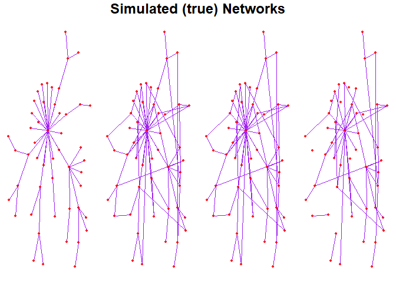
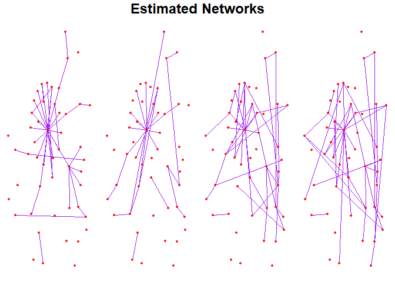

# `NExON` 

The `NExON` package implements the NExON-Bayes model, which is a
*Bayesian approach to joint network estimation informed by ordinal
covariates*. The modelling framework extends the graphical
spike-and-slab methodology of Wang (2015) to account for ordinal
covariates, jointly estimating their relevance to the graph structure
and leveraging them as borrowing information to improve the accuracy of
network estimation. This has particular pertinence in biological
settings, whereby categorising data in this way and estimating graphical
networks as such is widely applicable. For example, when estimating the
biomolecular networks of patients with a particular disease,
incorporating auxiliary data (e.g., disease stage, genetic variance or
hormonal treatment) as covariate information will account for the
inherent heterogeneity of the networks and can lead to new insights in
the behaviours of biomolecular pathways.

The main function of the package, `NExON::NExON.Bayes` (the function
that implements NExON-Bayes), takes a list of data matrices, each with
varying numbers of multivariate samples containing *P* variables.
NExON-Bayes is a Gaussian graphical model, and so each sample is assumed
to have been drawn from a normal distribution. Samples within the same
data matrix, and thus described by the same ordinal covariate, are
assumed to have been drawn from the same normal distribution, and a
precision matrix (network) estimate corresponding to each data matrix is
made and returned by the function.

Functions for variable selection, simulating appropriate data and
plotting networks are also implemented in this package.

## Installation

To install the up-to-date version of the `NExON` package, paste the
following into the RStudio console:

``` r
remotes::install_github("jf687/NExON", dependencies = TRUE)
```

## Example

### Simulating a test dataset

The `NExON` package includes functionality to simulate precision
matrices that have a specified fraction of entries that are linearly
proportional to the ordinal covariate, with half of these specified
entries being positively proportional (“appearing edges”) and half being
negatively proportional (“disappearing edges”). The function ensures
that all matrices are positive definite by recursively calling itself
until positive definiteness is achieved. The function also generates
zero-mean multivariate normally distributed data, where the inverse of
the generated precision matrices are used as the distributions’
covariance matrices.

For this test dataset, we generate 4 networks (`A=4`) with 50 variables
(`P=50`). We then set 40% of the initial edges to have linear
correlation with the covariate (`frac_change = 0.4`). The input
`Ns_sample` relates to data generation, and is a list from which the
number of samples for each data matrix is randomly selected.
`network_seed` and `data_seed` can be used to ensure reproducibility.
`network_seed` sets a seed at the point of generating the networks,
whilst `data_seed` sets a seed at the point of generating data. To
generate several sets of data from the same precision matrices, keep
`network_seed` constant and change `data_seed`.

``` r
# generate simulated networks and data
sim_data <- NExON::simulate_networks(P = 50, A = 4, network_seed = 123, data_seed = 123, frac_change = 0.4, Ns_sample = c(150, 150, 150))
#> Solution found with network_seed =  252
```

The function can take time to find a positive definite solution. Pay
attention to the printed output, which tells us that the positive
definite solution is found with `network_seed = 252`. It’s useful to
change the seed input to save time if the function is run again:

``` r
sim_data <- NExON::simulate_networks(P = 50, A = 4, network_seed = 252, data_seed = 123, frac_change = 0.4, Ns_sample = c(150, 150, 150))
#> Solution found with network_seed =  252
```

To visualise the generated networks, we plot them using the
`NExON::create_network_plots()` function. Before doing so, we create a
graphical layout for the networks using the `NExON::create_layout( )`
function, which takes a network matrix as its input and outputs the
coordinates of a layout, using the Fruchterman–Reingold force-directed
layout algorithm which gives a balanced, spaced layout. This is done
using functionality from the `networks` R package (Butts (2008)). The
function `NExON::create_network_plots()` will then plot multiple
networks (with the same layout). Its first input is a list of networks
(represented by matrices) and the second is the `layout_coords` that are
generated by the `NExON::create_layout()` function.

For this example, we optimise the layout for the first network (of four)
by parsing the argument `sim_data$As[[1]]` into
`NExON::create_layout( )`. To plot these networks, the list of matrices
`sim_data$As` is parsed along with the `layout_coords` into the
`NExON::create_network_plots()` function. Importantly, `sim_data$As` is
a lsit of networks and not precision matrices (i.e. thresholding has
been performed on the precision matrices to produce matrices).

``` r
layout <- NExON::create_layout(sim_data$As[[1]])
NExON::create_network_plots(sim_data$As, layout_coords = layout, title = "Simulated (true) Networks")
```



    #> TableGrob (2 x 4) "arrange": 5 grobs
    #>   z     cells    name               grob
    #> 1 1 (2-2,1-1) arrange     gtable[layout]
    #> 2 2 (2-2,2-2) arrange     gtable[layout]
    #> 3 3 (2-2,3-3) arrange     gtable[layout]
    #> 4 4 (2-2,4-4) arrange     gtable[layout]
    #> 5 5 (1-1,1-4) arrange text[GRID.text.75]

### Finding optimal $\nu_0$ values

`NExON::find_v0_list()` takes the list of data matrices (`sim_data$Ys`)
and will select spike variances that optimise the estimations made by
the vanilla, single-network estimation model for each precision matrix,
based on the extended Bayesian information criteria. The function also
requires a sparsity control parameter, `gamma`, which takes a default
value of `0.5`. For this example, we use `gamma = 0.35`. The function
outputs a list of $\nu_0$ values that can is used as an argument in the
main network estimation function.

``` r
# (will take time)
v0_list <- NExON::find_v0_list(sim_data$Ys, gamma = 0.35, plot_ = FALSE)
```

### Performing network estimation

To perform joint network estimation, the main function of the package,
`NExON::NExON.Bayes()`, is used. This function takes a list of data
matrices (in this case `sim_data$Ys`) and a list of selected $\nu_0$s as
arguments (`v0_list`). The lists must be the same length.

``` r
results <- NExON::NExON.Bayes(sim_data$Ys, v0_list = v0_list)
#> Algorithm runtime:  5.69061 secs
```

`NExON::NExON.Bayes()` has several important outputs. Specifically:

- `$estimates..`
  - `..$Omegas` provides a list of the estimated precision matrices.
  - `..$m_deltas` provides a list of matrices of the posterior
    probability of inclusion values.

To obtain the (binary) network estimates using a standard PPI of 0.5 as
a threshold, use:

``` r
estimated_networks <- lapply(results$estimates$m_deltas, function(x) abs(x) > 0.5)
```

The estimated networks can be plotted with the same layout as the true
network plots by using the same `layout` argument as before

``` r
NExON::create_network_plots(estimated_networks, layout_coords = layout, title = "Estimated Networks")
```



    #> TableGrob (2 x 4) "arrange": 5 grobs
    #>   z     cells    name                grob
    #> 1 1 (2-2,1-1) arrange      gtable[layout]
    #> 2 2 (2-2,2-2) arrange      gtable[layout]
    #> 3 3 (2-2,3-3) arrange      gtable[layout]
    #> 4 4 (2-2,4-4) arrange      gtable[layout]
    #> 5 5 (1-1,1-4) arrange text[GRID.text.140]

### Performance Evaluation

To evaulate the performance of the estimations on the simulated data, we
focus on precision and recall. The function
`NExON::evaluate_network_list()` takes two lists of matrices as its
arguments: the first contains the true (simulated) networks and the
second contains the estimated networks. The function will calculate and
output a confusion matrix (`..$conf.mat`) containing the total number of
true positives, false negatives, false positives and true negatives
across all estimations. This confusion matrix is then parsed through the
`precision()` and `recall()` functions to obtain overall precision and
recall values.

``` r
conf.mat <- NExON::evaluate_network_list(sim_data$As, estimated_networks)$conf.mat
cat(paste0("precision: ", NExON::precision(conf.mat), "\n"))
#> precision: 0.886666666666667
cat(paste0("recall: ", NExON::recall(conf.mat), "\n"))
#> recall: 0.563559322033898
```

## References

<div id="refs" class="references csl-bib-body hanging-indent"
entry-spacing="0">

<div id="ref-Butts2008" class="csl-entry">

Butts, Carter T. 2008. “Network: A Package for Managing Relational Data
in r.” *Journal of Statistical Software* 24 (2).
<https://doi.org/10.18637/jss.v024.i02>.

</div>

<div id="ref-wang2015" class="csl-entry">

Wang, Hao. 2015. “Scaling It up: Stochastic Search Structure Learning in
Graphical Models.” *Bayesian Analysis* 10 (2): 351–77.

</div>

</div>
