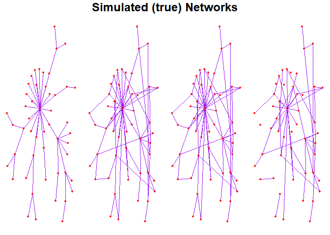
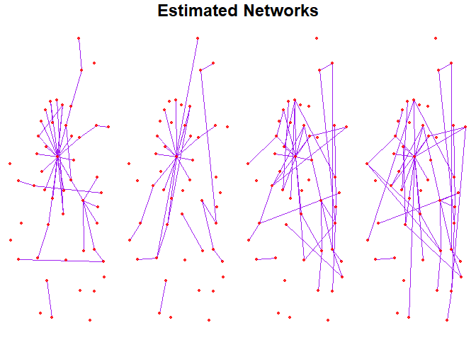

# `NExON` 

The `NExON` package implements the NExON-Bayes model, which is a
*Bayesian approach to joint network estimation informed by ordinal
covariates*. The modelling framework extends the graphical
spike-and-slab methodology of Wang (2015) to account for ordinal
covariates, jointly estimating their relevance to the graph structure
and leveraging them as borrowing information to improve the accuracy of
network estimation. This has particular pertinence in biological
settings, whereby categorising data in this way and estimating graphical
networks as such is widely applicable. For example, when estimating the
biomolecular networks of patients with a particular disease,
incorporating auxiliary data (e.g., disease stage, genetic variance or
hormonal treatment) as covariate information will account for the
inherent heterogeneity of the networks and can lead to new insights in
the behaviours of biomolecular pathways.

`NExON` (the function that implements NExON-Bayes) takes a list of data
matrices, each with varying numbers of multivariate samples containing
*P* variables. NExON-Bayes is a Gaussian graphical model, and so each
sample is assumed to have been drawn from a normal distribution. Samples
within the same data matrix, and thus described by the same ordinal
covariate, are assumed to have been drawn from the same normal
distribution, and a precision matrix (network) estimate corresponding to
each data matrix is made and returned by the function.

Functions for variable selection, simulating appropriate data and
plotting networks are also implemented in this package.

## Installation

To install the up-to-date version of the `NExON` package, paste the
following into the RStudio console:

``` r
remotes::install_github("jf687/NExON", dependencies = TRUE)
```

To build and view the vignette locally (recommended), use

``` r
remotes::install_github("jf687/NExON", dependencies = TRUE, build_vignettes = TRUE)
browseVignettes("NExON")
```

## Example

### Simulating a test dataset

The `NExON` package includes functionality to simulate precision
matrices that have a specified fraction of entries that are linearly
proportional to the ordinal covariate, with half of these specified
entries being positively proportional (“appearing edges”) and half being
negatively proportional (“disappearing edges”). The function ensures
that all matrices are positive definite by recursively calling itself
until positive definiteness is achieved.

For speed of use, the function will print the seed for which positive
definiteness is achieved with given arguments, so that the user can use
this seed as an input argument in the future if needed. The function
also generates zero-mean multivariate normally distributed data, where
the inverse of the generated precision matrices are used as the
distributions’ covariance matrices.

For this test dataset, we will generate 4 (`Cn=4`) networks with 50
variables (`P=50`). We then set 40% of the edges to have linear
correlation with the covariate (`frac_change = 0.4`). The input
`Ns_sample` is a list from which the number of samples for each data
matrix is randomly selected.

``` r
# generate simulated networks and data
sim_data <- NExON::create_Cn_networks(P = 50, Cn = 4, seed_1 = 123, seed_2 = 123, frac_change = 0.4, Ns_sample = c(150, 150, 150))
#> seed that works for P = 50 , frac = 0.4  :  252
```

The function can take time to find a positive definite solution. Pay
attention to the printed output, which tells us that the positive
definite solution is found with seed 252. It’s useful to change the seed
input to save time if the function is run again

``` r
sim_data <- NExON::create_Cn_networks(P = 50, Cn = 4, seed_1 = 252, seed_2 = 123, frac_change = 0.4, Ns_sample = c(150, 150, 150))
#> seed that works for P = 50 , frac = 0.4  :  252
```

To visualise the generated networks, we plot them. The
`NExON::create_layout( )` function takes a network matrix as its input
and outputs the coordinates of a layout, using the Fruchterman–Reingold
force-directed layout algorithm which gives a balanced, spaced layout.
This is done using functionality from the `networks` R package
((**Butts2008?**)). The function `NExON::create_network_plots()` will
then plot multiple networks (with the same layout). Its first input is a
list of networks (represented by matrices) and the second is the
`layout_coords` that are generated by the `NExON::create_layout()`
function.

For this example, we optimise the layout for the first network (of four)
by parsing the argument `sim_data$As[[1]]`. Note that `sim_data$As` are
the networks that correspond to the generated precision matrices
(`sim_data$Omegas`), where non-zero values are simply represented with a
`1` and zero values with `0`. To plot these networks, the list of
matrices `sim_data$As` is parsed along with the `layout_coords` into the
`NExON::create_network_plots()` function.

``` r
# plot the true networks
layout <- NExON::create_layout(sim_data$As[[1]])
NExON::create_network_plots(sim_data$As, layout_coords = layout)
```



    #> TableGrob (2 x 4) "arrange": 5 grobs
    #>   z     cells    name               grob
    #> 1 1 (2-2,1-1) arrange     gtable[layout]
    #> 2 2 (2-2,2-2) arrange     gtable[layout]
    #> 3 3 (2-2,3-3) arrange     gtable[layout]
    #> 4 4 (2-2,4-4) arrange     gtable[layout]
    #> 5 5 (1-1,1-4) arrange text[GRID.text.75]

### Finding optimal $\nu_0$ values

`NExON::find_v0_list()` takes the list of data matrices (`sim_data$Ys`)
and will select spike variances that optimise the estimations made by
the vanilla, single-network estimation model for each precision matrix,
based on the extended Bayesian information criteria. The function also
requires a sparsity control parameter, `gamma`, which takes a default
value of `0.5`. For this example, we use `gamma <- 0.35`. The function
outputs a list of $\nu_0$ values that can is used as an argument in the
main network estimation function.

``` r
# (will take time)
v0_list <- NExON::find_v0_list(sim_data$Ys, gamma = 0.35, plot_ = FALSE)
```

\#\<- c(0.02,0.02,0.02,0.02) \#NExON::find_v0_list(sim_data\$Ys,gamma =
0.35, plot\_ = FALSE)

### Performing network estimation

To perform joint network estimation, the main function of the package,
`NExON::NExON()`, is used. This function takes a list of data matrices
(in this case `sim_data$Ys`) and a list of selected $\nu_0$s as
arguments (`v0_list`). The lists must be the same length.

``` r
results <- NExON::NExON(sim_data$Ys, v0_list = v0_list)
#> Algorithm runtime:  4.875372 secs
```

`NExON::NExON()` has several important outputs. Specifically:

- `$estimates..`
  - `..$Omegas` provides a list of the estimated precision matrices.
  - `..$m_deltas` provides a list of matrices of the posterior
    probability of inclusion values.

To obtain the (binary) network estimates using a standard PPI of 0.5 as
a threshold, use:

``` r
estimated_networks <- lapply(results$estimates$m_deltas, function(x) abs(x) > 0.5)
```

The estimated networks can be plotted the same layout as the true
network plots by using the same `layout` argument as before

``` r
NExON::create_network_plots(estimated_networks, layout_coords = layout)
```



    #> TableGrob (2 x 4) "arrange": 5 grobs
    #>   z     cells    name                grob
    #> 1 1 (2-2,1-1) arrange      gtable[layout]
    #> 2 2 (2-2,2-2) arrange      gtable[layout]
    #> 3 3 (2-2,3-3) arrange      gtable[layout]
    #> 4 4 (2-2,4-4) arrange      gtable[layout]
    #> 5 5 (1-1,1-4) arrange text[GRID.text.140]

### Performance Evaluation

To evaulate the performance of the estimations on the simulated data, we
focus on precision and recall. `NExON::evaluate_network_list()` will
calculate a confusion matrix, which is then parsed through the
`precision()` and `recall()` functions to obtain precision and recall
values.

The function `NExON::evaluate_network_list()` takes two lists of
matrices as its arguments. The first contains the true (simulated)
networks and the second contains the estimated networks.

``` r
conf.mat <- NExON::evaluate_network_list(sim_data$As, estimated_networks)$conf.mat
cat(paste0("precision: ", NExON::precision(conf.mat), "\n"))
#> precision: 0.886666666666667
cat(paste0("recall: ", NExON::recall(conf.mat), "\n"))
#> recall: 0.563559322033898
```

<div id="refs" class="references csl-bib-body hanging-indent"
entry-spacing="0">

<div id="ref-wang2015" class="csl-entry">

Wang, Hao. 2015. “Scaling It up: Stochastic Search Structure Learning in
Graphical Models.” *Bayesian Analysis* 10 (2): 351–77.

</div>

</div>
